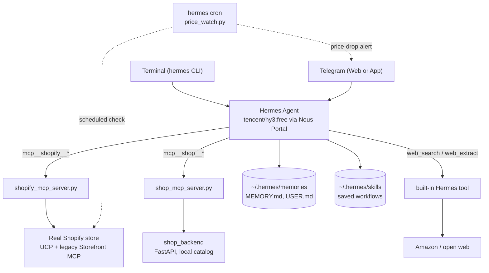

# Hermes Shopping Assistant

An AI shopping assistant built on the Hermes Agent framework. It can search and manage a cart
against a local demo shop, or against a real Shopify store over UCP (Universal Commerce
Protocol) with a working checkout, and can be deployed to a free cloud VM reachable over
Telegram.

## Quick start

- **Setting this up on your own machine?** Follow [`PARTICIPANT_SETUP.pdf`](PARTICIPANT_SETUP.pdf)
  start to end. Section 1 gets it running locally (~15 min); Section 2 is optional and deploys
  the same assistant to a free cloud VM with a real Telegram bot and a real Shopify store.
- **Following along live?** [`PROMPTS.pdf`](PROMPTS.pdf) has every prompt used during the demo,
  phase by phase, labeled with exactly which terminal or app to type it into.

## Project structure

```
.
├── shop_backend/                       FastAPI backend for the local demo shop
│   ├── main.py                          App entry point and routes
│   ├── models.py                        Data models
│   └── data.py                          Product catalog
├── mcp_server/                         MCP tool servers Hermes connects to
│   ├── shop_mcp_server.py               Wraps the local demo shop
│   ├── shopify_mcp_server.py            Wraps a real Shopify store over UCP
│   └── price_watch.py                   Standalone script for a scheduled price-watch job
├── hermes/                             Hermes Agent configuration
│   ├── cli-config.yaml                  Model, tool, and platform settings
│   └── SOUL.md                          Assistant persona and behavior
├── scripts/
│   └── refresh_nous_auth.ps1            Refreshes a deployed VM's Nous login when it goes stale
├── shopify_products_import_with_images.csv   Sample catalog for a Shopify dev store
├── Dockerfile                          Container build for the hosted Telegram deployment
├── entrypoint.sh                       Container startup script
├── requirements.txt                    Python dependencies
├── PARTICIPANT_SETUP.pdf               Full setup guide, Section 1 (local) + Section 2 (cloud)
└── PROMPTS.pdf                         Every live-demo prompt, phase by phase
```

## Architecture

Three data sources, one agent. Hermes decides which to use per request based on what the
user says (`hermes/SOUL.md` holds the routing rules), and every source is a real integration,
not a mock behind the scenes:



- **`mcp__shop__*`**: the local demo shop, a FastAPI backend (`shop_backend/`) with a
  10-product catalog, wrapped as MCP tools by `shop_mcp_server.py`. Nothing here is a real
  purchase; it's a self-contained sandbox so the agent has real tool calls to make without
  depending on the network.
- **`mcp__shopify__*`**: a real Shopify store, reached over UCP (search/catalog) and the
  legacy Storefront MCP (cart operations, worked around a UCP cart bug, see the comments in
  `shopify_mcp_server.py`). Checkout is real, using Shopify's Bogus Gateway test card.
- **`web_search` / `web_extract`**: Hermes's own built-in tools, used for anything outside
  both catalogs above (e.g. "search Amazon").
- **Memory and skills** persist across sessions on disk, independent of any single
  conversation. That's what makes the "what's my usual size?" and "save this as a skill"
  moments work in a brand-new session.
- **`hermes cron`** runs `price_watch.py` on a schedule, checking the real Shopify store and
  messaging Telegram only when a tracked price actually drops.

## Requirements

Python 3.11 recommended (3.10+ works), VS Code. See [`PARTICIPANT_SETUP.pdf`](PARTICIPANT_SETUP.pdf)
for full setup steps.
